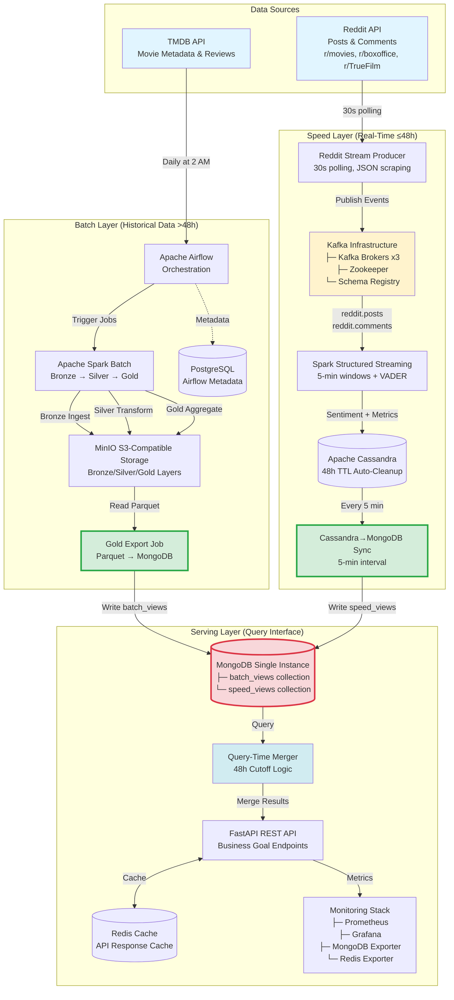

# Complete Lambda Architecture - Movie Data Analysis Pipeline

> **Updated:** December 28, 2025  
> **All Components Included** - No intermediate steps missing

---

## 🏗️ High-Level Architecture Overview



---

## 📊 Detailed Component Breakdown

### **Data Sources**

#### 1. TMDB API (Batch Layer)
- **Purpose:** Historical movie metadata and baseline sentiment
- **Data Types:** Movie metadata, genres, limited reviews (top 50 movies)
- **Volume:** ~2,000 movies
- **Update Frequency:** Daily at 2 AM
- **API Rate Limit:** 4 requests/second
- **Authentication:** API key required

#### 2. Reddit API (Speed Layer)
- **Purpose:** Real-time social engagement and sentiment
- **Data Types:** Posts, comments, upvotes, awards
- **Volume:** 500-2,000 posts/day + 10K-50K comments/day
- **Update Frequency:** 30-second polling
- **Authentication:** None (JSON scraping via `.json` endpoints)
- **Subreddits:** r/movies, r/boxoffice, r/TrueFilm

---

### **Batch Layer - Historical Processing (>48 hours old)**

```
TMDB API
    ↓ (Airflow DAG scheduled daily at 2 AM)
┌─────────────────────────────────────────────────────────┐
│ APACHE AIRFLOW - Orchestration Layer                   │
│ ├─ airflow-webserver (port 8088)                       │
│ ├─ airflow-scheduler                                   │
│ └─ PostgreSQL (metadata store)                         │
└────────────────────┬────────────────────────────────────┘
                     ↓ (Trigger Spark jobs)
┌─────────────────────────────────────────────────────────┐
│ BRONZE LAYER (MinIO)                                    │
│ • Raw TMDB data ingestion                              │
│ • Parquet format: tmdb_movies, tmdb_reviews, genres   │
│ • Partition: /data_type                                │
│ • Storage: s3a://bronze-data/                          │
└────────────────────┬────────────────────────────────────┘
                     ↓ (Spark batch job: bronze_ingest.py)
┌─────────────────────────────────────────────────────────┐
│ SILVER LAYER (MinIO)                                    │
│ • Data enrichment & baseline calculation               │
│ • 3 datasets generated:                                │
│   1. sentiment_baselines (genre/franchise patterns)    │
│   2. viral_thresholds (genre/budget/season cutoffs)    │
│   3. movie_intelligence (individual movie data)        │
│ • Storage: s3a://silver-data/{dataset_type}/           │
└────────────────────┬────────────────────────────────────┘
                     ↓ (Spark batch job: silver_transform.py)
┌─────────────────────────────────────────────────────────┐
│ GOLD LAYER (MinIO)                                      │
│ • Add temporal metadata                                │
│ • Prepare for MongoDB export                           │
│ • Keep 3 datasets SEPARATE                             │
│ • Storage: s3a://gold-data/batch_views/                │
└────────────────────┬────────────────────────────────────┘
                     ↓ (Gold export job: gold_aggregate.py)
┌─────────────────────────────────────────────────────────┐
│ ⭐ GOLD EXPORT CONNECTOR (CRITICAL COMPONENT)          │
│ • Reads Parquet from Gold layer                        │
│ • Writes to MongoDB batch_views collection             │
│ • 3 view_types: sentiment_baseline, viral_threshold,   │
│                 movie_intelligence                      │
│ • Total documents: ~5,821 (as of Dec 2025)             │
└────────────────────┬────────────────────────────────────┘
                     ↓
              MongoDB batch_views
```

**Key Technologies:**
- **Orchestration:** Apache Airflow 2.7.3
- **Processing:** Apache Spark 3.5.4 (PySpark)
- **Storage:** MinIO (S3-compatible)
- **Metadata DB:** PostgreSQL 15

---

### **Speed Layer - Real-Time Processing (≤48 hours)**

```
Reddit API (JSON endpoints)
    ↓ (30-second polling, no authentication)
┌─────────────────────────────────────────────────────────┐
│ REDDIT STREAM PRODUCER                                  │
│ • Scrapes r/movies, r/boxoffice, r/TrueFilm            │
│ • TMDB movie title validation (fuzzy matching)         │
│ • Rate limit: 1 request per 2 seconds                  │
│ • Deduplication via seen_posts/seen_comments sets      │
└────────────────────┬────────────────────────────────────┘
                     ↓ (Publish to Kafka topics)
┌─────────────────────────────────────────────────────────┐
│ KAFKA INFRASTRUCTURE (CRITICAL COMPONENTS)              │
│ ┌─────────────────────────────────────────────────┐   │
│ │ Kafka Brokers (x3)                              │   │
│ │ ├─ kafka-1:29092 (internal) / :9092 (external) │   │
│ │ ├─ kafka-2:29092 (internal) / :9093 (external) │   │
│ │ └─ kafka-3:29092 (internal) / :9094 (external) │   │
│ │ • Topics: reddit.posts, reddit.comments         │   │
│ │ • Partitions: 3 per topic                       │   │
│ │ • Retention: 48 hours                           │   │
│ │ • Replication factor: 3                         │   │
│ └─────────────────────────────────────────────────┘   │
│ ┌─────────────────────────────────────────────────┐   │
│ │ Zookeeper (REQUIRED)                            │   │
│ │ • Kafka cluster coordination                    │   │
│ │ • Port: 2181                                    │   │
│ └─────────────────────────────────────────────────┘   │
│ ┌─────────────────────────────────────────────────┐   │
│ │ Schema Registry                                 │   │
│ │ • Avro schema management                        │   │
│ │ • Port: 8081                                    │   │
│ └─────────────────────────────────────────────────┘   │
└────────────────────┬────────────────────────────────────┘
                     ↓ (Consume from topics)
┌─────────────────────────────────────────────────────────┐
│ SPARK STRUCTURED STREAMING                              │
│ • Job: reddit_sentiment_stream.py                       │
│ • 5-minute tumbling windows                             │
│ • VADER sentiment analysis on titles + comments         │
│ • Viral metrics calculation:                            │
│   - upvote_velocity (upvotes/hour)                      │
│   - comment_velocity (comments/hour)                    │
│   - award_velocity (awards/hour)                        │
│   - viral_score (combined metric)                       │
│ • Watermark: 30 seconds for late data                   │
└────────────────────┬────────────────────────────────────┘
                     ↓ (Write to Cassandra)
┌─────────────────────────────────────────────────────────┐
│ APACHE CASSANDRA (Temporary Storage)                    │
│ • Tables:                                               │
│   - reddit_post_metrics (movie_title, hour, window)    │
│   - reddit_comment_metrics (movie_title, hour, window) │
│ • Partition key: (movie_title, hour, window_start)     │
│ • TTL: 48 hours (AUTO-CLEANUP)                          │
│ • Purpose: High-throughput writes from Spark            │
│ • Port: 9042                                            │
└────────────────────┬────────────────────────────────────┘
                     ↓ (5-minute sync interval)
┌─────────────────────────────────────────────────────────┐
│ ⭐ CASSANDRA→MONGODB SYNC CONNECTOR (CRITICAL)         │
│ • Service: speed-cassandra-mongo-sync                   │
│ • Reads from Cassandra tables every 5 minutes           │
│ • Transforms to MongoDB document format                 │
│ • Upserts to speed_views collection                     │
│ • Creates indexes on movie_title, data_type, hour       │
│ • Sets TTL expiration (48h from hour timestamp)         │
│ • Sync count per cycle: ~hundreds of documents          │
└────────────────────┬────────────────────────────────────┘
                     ↓
              MongoDB speed_views
```

**Key Technologies:**
- **Streaming:** Kafka 7.4.0 (Confluent), Spark Structured Streaming
- **Coordination:** Zookeeper 7.4.0
- **Schema:** Confluent Schema Registry
- **Storage:** Cassandra 4.1
- **Sync:** Custom Python connector (cassandra-driver + pymongo)

---

### **Serving Layer - Query Interface**

```
┌─────────────────────────────────────────────────────────┐
│ MONGODB - Single Instance (Dual Collections)            │
│                                                          │
│ ┌────────────────────────────────────────────────────┐ │
│ │ batch_views Collection (>48h old)                  │ │
│ │ • Documents: ~5,821 (Dec 2025)                     │ │
│ │ • View types:                                      │ │
│ │   - sentiment_baseline (850 docs)                  │ │
│ │   - viral_threshold (27 docs)                      │ │
│ │   - movie_intelligence (4,944 docs)                │ │
│ │ • Updated: Daily at 2 AM                           │ │
│ │ • Indexes: 12 compound indexes                     │ │
│ └────────────────────────────────────────────────────┘ │
│                                                          │
│ ┌────────────────────────────────────────────────────┐ │
│ │ speed_views Collection (≤48h old)                  │ │
│ │ • Data types:                                      │ │
│ │   - reddit_post (5-min windows)                    │ │
│ │   - reddit_comment (5-min windows)                 │ │
│ │ • TTL: 48 hours (auto-expiration)                  │ │
│ │ • Updated: Every 5 minutes                         │ │
│ │ • Indexes: 8 indexes (movie_title, viral_score)    │ │
│ └────────────────────────────────────────────────────┘ │
│                                                          │
│ Port: 27017                                              │
│ Auth: admin/password                                     │
└────────────────────┬────────────────────────────────────┘
                     ↓ (Query both collections)
┌─────────────────────────────────────────────────────────┐
│ QUERY-TIME MERGER (48-Hour Cutoff Logic)                │
│ • Class: ViewMerger (view_merger.py)                    │
│ • Strategy:                                             │
│   - Batch layer: Accurate historical baselines         │
│   - Speed layer: Fresh real-time Reddit data            │
│   - On overlap: Speed layer takes precedence            │
│ • Merge functions:                                      │
│   - merge_movie_views()                                 │
│   - merge_sentiment_data()                              │
│   - merge_viral_data()                                  │
│   - merge_trending_views()                              │
└────────────────────┬────────────────────────────────────┘
                     ↓ (Merged results)
┌─────────────────────────────────────────────────────────┐
│ REDIS CACHE                                              │
│ • Cache TTL: 30 minutes                                 │
│ • Max memory: 256MB                                     │
│ • Eviction: allkeys-lru                                 │
│ • Port: 6379                                            │
└────────────────────┬────────────────────────────────────┘
                     ↓ (API responses)
┌─────────────────────────────────────────────────────────┐
│ FASTAPI REST API                                         │
│ • Port: 8000                                            │
│ • Endpoints:                                            │
│   - /api/v1/movies/{movie_title}/sentiment             │
│   - /api/v1/movies/{movie_title}/viral                 │
│   - /api/v1/recommendations/dual-success               │
│   - /api/v1/recommendations/reddit-buzz                │
│   - /api/v1/recommendations/similar-movies             │
│ • Business Goals:                                       │
│   1. PR Crisis Detection & Sentiment Monitoring        │
│   2. Viral Content Detection                           │
│   3. Content Recommendation Optimization               │
└────────────────────┬────────────────────────────────────┘
                     ↓ (Metrics)
┌─────────────────────────────────────────────────────────┐
│ MONITORING STACK                                         │
│ ┌─────────────────────────────────────────────────┐   │
│ │ Prometheus (port 9090)                          │   │
│ │ • Scrapes metrics from:                         │   │
│ │   - MongoDB Exporter (port 9216)                │   │
│ │   - Redis Exporter (port 9121)                  │   │
│ │   - FastAPI /metrics endpoint                   │   │
│ └─────────────────────────────────────────────────┘   │
│ ┌─────────────────────────────────────────────────┐   │
│ │ Grafana (port 3001)                             │   │
│ │ • Dashboards:                                   │   │
│ │   - System Health                               │   │
│ │   - API Performance                             │   │
│ │   - MongoDB Metrics                             │   │
│ │   - Redis Cache Hit Rate                        │   │
│ └─────────────────────────────────────────────────┘   │
└─────────────────────────────────────────────────────────┘
```

**Key Technologies:**
- **Database:** MongoDB 7.0
- **Cache:** Redis 7 (Alpine)
- **API:** FastAPI (Python 3.11)
- **Monitoring:** Prometheus + Grafana
- **Exporters:** MongoDB Exporter, Redis Exporter

---

## 🔄 Complete Data Flow Diagram

```
┌──────────────────────────────────────────────────────────────────────────┐
│                          DATA SOURCES                                     │
│  ┌─────────────────────┐              ┌─────────────────────────────┐   │
│  │   TMDB API          │              │      Reddit API             │   │
│  │ (Movie Metadata)    │              │  (Social Engagement)        │   │
│  └──────────┬──────────┘              └──────────┬──────────────────┘   │
└─────────────┼──────────────────────────────────┼────────────────────────┘
              │                                    │
              │ Daily 2AM                          │ 30-second polling
              ↓                                    ↓
┌─────────────────────────────┐    ┌──────────────────────────────────────┐
│   BATCH LAYER               │    │        SPEED LAYER                    │
│   (Historical >48h)         │    │        (Real-Time ≤48h)               │
│                             │    │                                       │
│  Airflow Orchestration      │    │  Reddit Producer                      │
│         ↓                   │    │         ↓                             │
│  Spark Bronze Ingest        │    │  Kafka Infrastructure                 │
│         ↓                   │    │  ├─ Brokers (x3)                      │
│  MinIO Bronze Layer         │    │  ├─ Zookeeper ⭐                      │
│         ↓                   │    │  └─ Schema Registry ⭐                │
│  Spark Silver Transform     │    │         ↓                             │
│         ↓                   │    │  Spark Structured Streaming           │
│  MinIO Silver Layer         │    │  (5-min windows + VADER)              │
│  (3 datasets)               │    │         ↓                             │
│         ↓                   │    │  Cassandra (48h TTL) ⭐               │
│  Spark Gold Aggregate       │    │         ↓                             │
│         ↓                   │    │  Cassandra→MongoDB Sync ⭐⭐         │
│  MinIO Gold Layer           │    │  (5-min interval)                     │
│         ↓                   │    │         ↓                             │
│  Gold Export Connector ⭐⭐ │    │  MongoDB speed_views                  │
│         ↓                   │    │         ↓                             │
│  MongoDB batch_views        │    │         │                             │
│         ↓                   │    │         │                             │
└─────────┼───────────────────┘    └─────────┼─────────────────────────────┘
          │                                   │
          │                                   │
          └───────────────┬───────────────────┘
                          ↓
        ┌──────────────────────────────────────────────┐
        │         SERVING LAYER                         │
        │    (Query-Time Merge & Caching)              │
        │                                              │
        │  ┌────────────────────────────────────┐     │
        │  │  MongoDB (Single Instance)         │     │
        │  │  ├─ batch_views (~5,821 docs)      │     │
        │  │  └─ speed_views (TTL 48h)          │     │
        │  └─────────────┬──────────────────────┘     │
        │                ↓                             │
        │  ┌────────────────────────────────────┐     │
        │  │  Query-Time Merger                 │     │
        │  │  (48h cutoff logic)                │     │
        │  └─────────────┬──────────────────────┘     │
        │                ↓                             │
        │  ┌────────────────────────────────────┐     │
        │  │  Redis Cache (30min TTL)           │     │
        │  └─────────────┬──────────────────────┘     │
        │                ↓                             │
        │  ┌────────────────────────────────────┐     │
        │  │  FastAPI REST API                  │     │
        │  │  (Business Goal Endpoints)         │     │
        │  └─────────────┬──────────────────────┘     │
        │                ↓                             │
        │  ┌────────────────────────────────────┐     │
        │  │  Monitoring Stack                  │     │
        │  │  (Prometheus + Grafana)            │     │
        │  └────────────────────────────────────┘     │
        └──────────────────────────────────────────────┘

Legend:
⭐   = Important component often overlooked
⭐⭐ = CRITICAL component that bridges layers
```

---

## 🎯 Lambda Architecture Characteristics

### Batch Layer
- **Purpose:** Accurate historical baselines and statistical context
- **Latency:** High (daily updates)
- **Accuracy:** High (complete data processing)
- **Data Age:** >48 hours old
- **Storage:** MinIO (Parquet) → MongoDB (batch_views)

### Speed Layer
- **Purpose:** Fresh real-time social engagement metrics
- **Latency:** Low (~5 minutes)
- **Accuracy:** Approximate (streaming approximations)
- **Data Age:** ≤48 hours
- **Storage:** Cassandra (temp) → MongoDB (speed_views)

### Serving Layer
- **Purpose:** Merge both layers for optimal query results
- **Strategy:** 48-hour cutoff (speed takes precedence for recent data)
- **Caching:** Redis (30-minute TTL)
- **Query Interface:** FastAPI REST endpoints

---

## ✅ All Critical Components Verified

| Component | Status | Purpose |
|-----------|--------|---------|
| TMDB API | ✅ Present | Historical movie data source |
| Reddit API | ✅ Present | Real-time social engagement source |
| Apache Airflow | ✅ Present | Batch orchestration |
| Apache Spark (Batch) | ✅ Present | Bronze/Silver/Gold transformations |
| MinIO | ✅ Present | S3-compatible storage (Bronze/Silver/Gold) |
| PostgreSQL | ✅ Present | Airflow metadata database |
| **Gold Export Connector** | ⭐⭐ **ADDED** | Exports Parquet → MongoDB batch_views |
| Reddit Stream Producer | ✅ Present | Scrapes Reddit, validates titles |
| Kafka Brokers (x3) | ✅ Present | Event streaming |
| **Zookeeper** | ⭐ **ADDED** | Kafka coordination (required!) |
| **Schema Registry** | ⭐ **ADDED** | Avro schema management |
| Spark Structured Streaming | ✅ Present | Real-time processing (5-min windows) |
| Apache Cassandra | ✅ Present | High-throughput temporary storage |
| **Cassandra→MongoDB Sync** | ⭐⭐ **ADDED** | Bridges speed layer to serving layer |
| MongoDB (batch_views) | ✅ Present | Batch layer query interface |
| MongoDB (speed_views) | ✅ Present | Speed layer query interface |
| Query-Time Merger | ✅ Present | 48h cutoff merge logic |
| Redis Cache | ✅ Present | API response caching |
| FastAPI | ✅ Present | REST API endpoints |
| Prometheus + Grafana | ✅ Present | Monitoring and visualization |

---

## 📌 Key Corrections from Original Diagram

1. **TMDB API** (was incorrectly labeled "IMDB API")
2. **MinIO Storage** (was labeled "MinIO/HDFS" - no HDFS in implementation)
3. **Kafka Infrastructure** expanded to show Zookeeper + Schema Registry
4. **Cassandra→MongoDB Sync** connector explicitly shown (was missing)
5. **Gold Export Connector** shown explicitly (was implied)
6. **MongoDB as single instance** with two collections (not two separate databases)
7. **Monitoring stack** components detailed

---

## 🚀 Services Running

| Service | Port | Purpose |
|---------|------|---------|
| MongoDB | 27017 | Serving layer database |
| Mongo Express | 8082 | MongoDB web UI |
| Redis | 6379 | API cache |
| FastAPI | 8000 | REST API |
| Prometheus | 9090 | Metrics collection |
| Grafana | 3001 | Dashboards |
| MinIO | 9000 | S3 API |
| MinIO Console | 9001 | MinIO web UI |
| PostgreSQL | 5432 | Airflow metadata |
| Airflow Webserver | 8088 | Airflow UI |
| Kafka Broker 1 | 9092 | Kafka external |
| Kafka Broker 2 | 9093 | Kafka external |
| Kafka Broker 3 | 9094 | Kafka external |
| Zookeeper | 2181 | Kafka coordination |
| Schema Registry | 8081 | Avro schemas |
| Cassandra | 9042 | CQL interface |

---

## 📖 Related Documentation

- [README.md](../README.md) - Project overview
- [Batch Layer Guide](../layers/batch_layer/README.md) - Batch processing details
- [Speed Layer Guide](../layers/speed_layer/README.md) - Real-time processing
- [Serving Layer Guide](../layers/serving_layer/README.md) - API and query merger
- [Docker Compose](../docker-compose.yml) - Infrastructure definition

---

**Last Updated:** December 28, 2025  
**Architecture Type:** Lambda Architecture  
**Status:** ✅ Fully Operational
